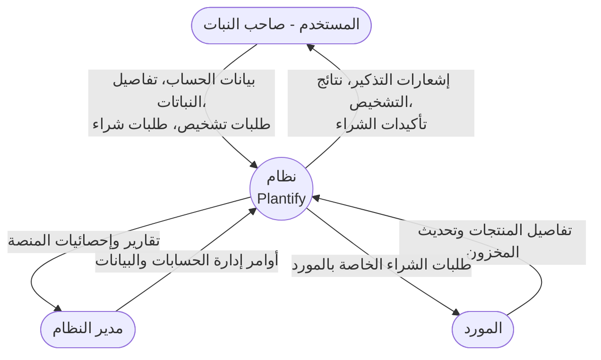
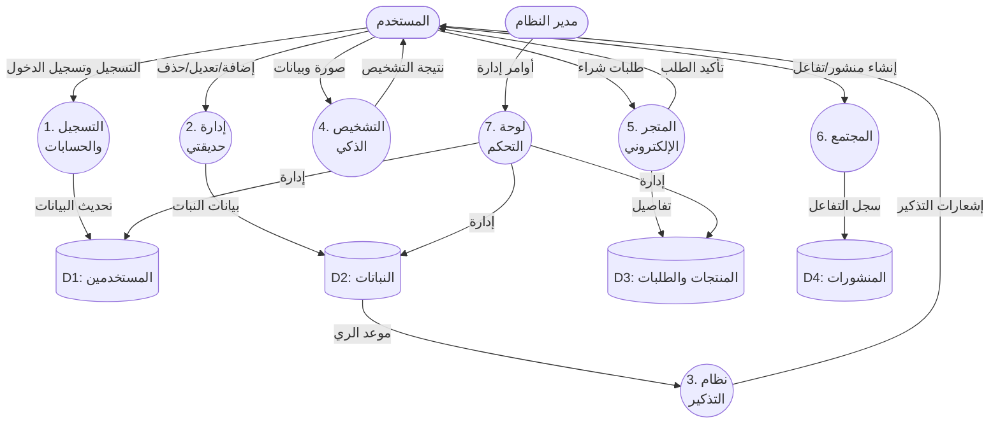
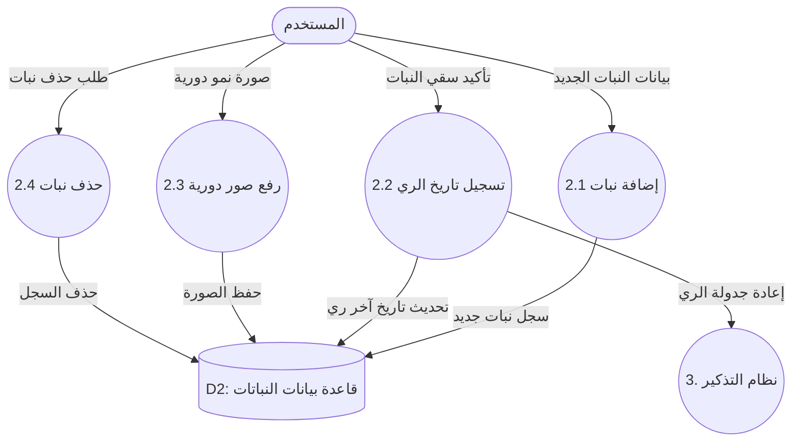
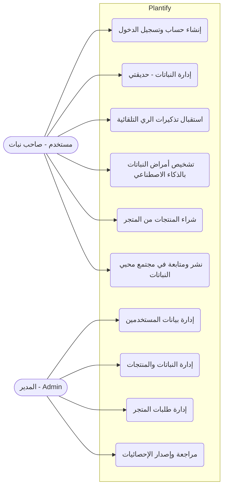
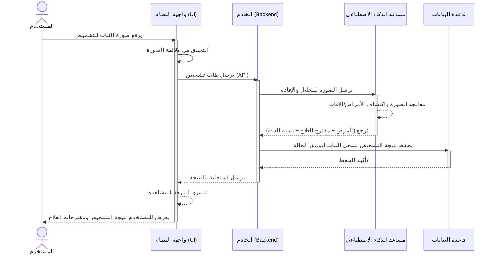

# رسومات تحليل نظام Plantify

بناءً على ملف متطلبات النظام الذي قمت بإرفاقه، قمت بإعداد الرسومات الخمسة (بصيغة مخططات تفاعلية) مطابقة للصور والملفات المطلوبة:

---

## 1. مخطط السياق (Context Diagram / Level -1) 
يُظهر النظام كوحدة واحدة وكيفية تفاعل الكيانات الخارجية معه.

---

## 2. مخطط تدفق البيانات للمستوى صفر (Level 0 DFD)
يُفكك النظام إلى عملياته الرئيسية (الوحدات الوظيفية) مع توضيح قواعد البيانات.

---

## 3. المخطط الفرعي (Child Diagrams / Level 1 DFD) - وحدة "حديقتي"
تفصيل دقيق لوحدة إدارة النباتات (حديقتي).

---

## 4. مخطط حالة الاستخدام (Use Case Diagram)
يوضح التفاعلات بين الفئات المستهدفة والنظام ككل.

---

## 5. مخطط التسلسل (Sequence Diagram) - عملية التشخيص الذكي
تتبع ترتيب العمليات الزمني لوحدة التشخيص الذكي (حيث يرفع المستخدم صورة للنبات المريض).

